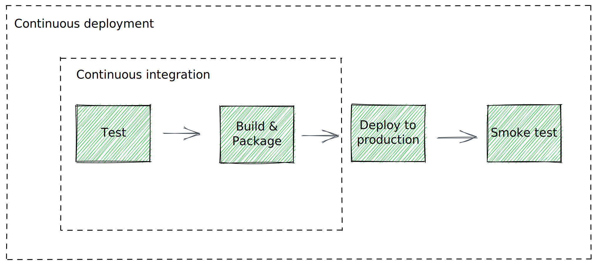
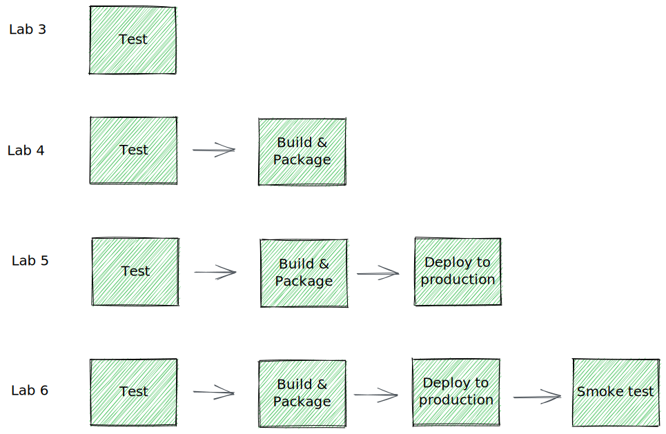

# Continuous delivery playground

This tutorial walks you through setting up a continuous delivery pipeline from scratch. This guide is for people that want to learn continuous delivery concepts by practicing.

Continuous delivery playground is optimized for learning, which means taking the long route to ensure you understand each of the concepts behind a modern continuous delivery pipeline.

## Target Audience

The target audience is someone new to CI/CD trying to get hands-on experience implementing a modern continuous delivery pipeline. We have also used this tutorial to facilitate remote workshops with bootcamps that want to introduce CI/CD concepts to their students.

These are the bootcamps we collaborated with so far:

- [BCN FemTech - Factoría F5](https://factoriaf5.org/bcn-femtech/)

## The labs

Following a series of labs, we will build a continuous deployment pipeline where every step is automated. Each lab introduces a new CI/CD concept and implements a new step of the pipeline. The first few labs are focused on understanding the tools and how to create pipelines in Github Actions. If you complete all the labs, you will have a working pipeline and a good foundation on how to apply CI/CD principles and practices to your projects.

> The results of this tutorial should not be viewed as production ready, but don't let that stop you from learning!

## The tools

By the end of each of the labs you will learn one continuous delivery concept and implement it in a working CD pipeline using Github Actions. While Github Actions is used for implementing a CD pipeline, the lessons learned in this tutorial can be applied to other platforms.

The stack:

- [NPM](https://www.npmjs.com/) as build tool
- [Next.js](https://nextjs.org/) to create the fake application to deploy
- [Github Actions](https://docs.github.com/en/actions/) as CI/CD platform

## Getting started

1. Fork this repository. If you are new to Github, you can learn how to fork [here](https://docs.github.com/en/get-started/quickstart/fork-a-repo).
2. Make sure you review the pre-requisites section to see if you have everything we need installed.
3. If you are new to NPM and Node.js, start by lab 1, otherwise you can start directly in lab 2.

## Labs

- [Prerequisites](docs/00-prerequisites.md)
- [Lab 1 - Local development workflow](docs/01-local-development.md)
- [Lab 2 - Creating a hello world pipeline](docs/02-creating-hello-world-pipeline.md)
- [Lab 3 - Continuous integration: Testing the application](docs/03-adding-test-to-the-pipeline.md)
- [Lab 4 - Continuous integration: Building and packaging the application](docs/04-building-and-packaging-the-application.md)
- [Lab 5 - Continuous delivery: Deploying the application to an environment](docs/05-deploying-to-an-environment.md)
- [Lab 6 - Continuous delivery: Adding a smoke test](docs/06-adding-a-smoke-test.md)
